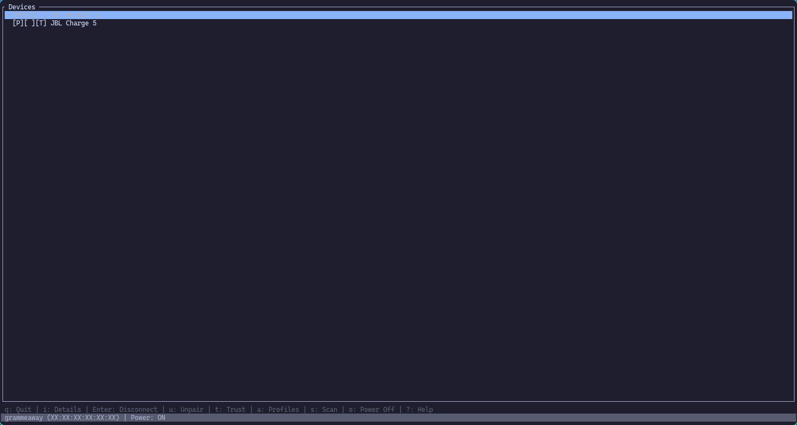

# Fünke 


A lightweight, TUI bluetooth manager, written in Rust. Manage connections, pair devices, and more.

TUI built using [ratatui](https://github.com/ratatui/ratatui).

## Features

- List available Bluetooth devices
- Connect to devices
- Pair and unpair devices
- View connection status
- Switch audio and input profiles

## Installation

### Pre-built Binaries
Pre-built binaries for Linux, Mac, and Windows are available on the [releases page](https://github.com/grammeaway/funke/releases). Download the appropriate version for your system, and move the binary to a directory in your PATH.

### Building from Source
To build Fünke from source, you need to have Rust installed. You can install Rust using [rustup](https://rustup.rs/). Once you have Rust set up, clone the repository and build the project by running:

```bash
cargo build --release
```
This will create an optimized binary in the `target/release` directory. You can then move this binary to a directory in your PATH for easy access.

### Installing from source with Cargo
If you have Rust and Cargo installed, you can install Fünke directly from the command line using Cargo - make sure you are in the root directory of the project, then run:

```bash
cargo install --path .
```

## TODO / Roadmap

- [ ] Fünke CLI, for people who prefer command line tools

- [ ] Automate new releases with GitHub Actions

- [ ] `funke version` command to display current version, and validate successful installation
## AI Usage Disclosure 
This project was developed with the assistance of AI tools, specifically Claude Code managed through a Ralph loop. 
